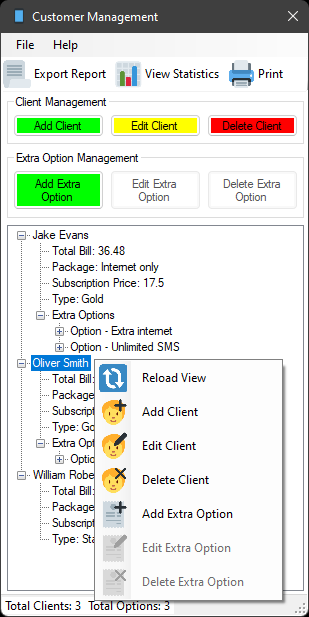
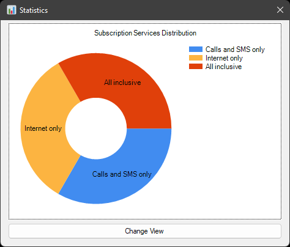

<h1 align="center">Cellphone service management app</h1>
<h4 align="center"><i>Individual project for my Windows applications programm class in C#</i></h2>

# Description
This GitHub repository contains a C# application built using WinForms that allows you to efficiently manage the clients of a cellphone service company.  
With this app, you can effortlessly add clients, assign them subscriptions, and include additional options as needed.  
Here are some key features of the application:  
- Client Management: Easily add and manage clients within the app's intuitive user interface.  

- Client Statistics: Gain valuable statistics and analytics about clients, enabling data-driven decision-making.  

- Report Generation: Generate comprehensive reports that provide insights into the performance of the cellphone service.  

